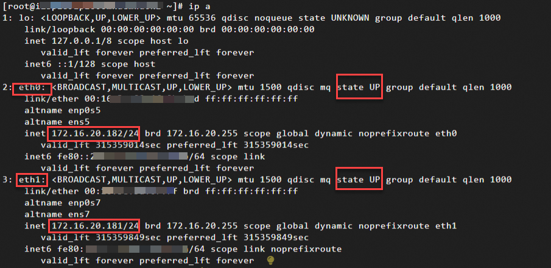
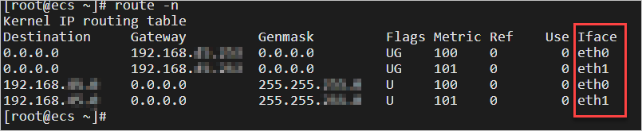

`ip a` 确认网卡信息



- 网卡标识：eth0、eth1，本示例中，实例共2张弹性网卡，一张主网卡eth0、一张辅助弹性网卡eth1。

- 网卡状态：state UP，表示网卡状态正常，即网卡已经在实例内部生效。

`route -n` 查看路由信息



- Destination为192.168.xx.xx的路由：指定了特定子网内的路由。该路由确保本机可以正确地识别并直接与子网内的其他主机进行通信，而无需经过额外的路由器。

- Destination为0.0.0.0的路由：默认路由，当数据包的目标地址未匹配到路由表中更具体的路由条目（如针对特定子网或主机的路由）时，系统将选择默认路由。此时，数据包将通过 Iface 指定的网络接口发送到 Gateway 指定的下一跳地址进行转发。

- 当存在多条默认路由时，路由优先级由Metric决定，Metric值越小，优先级越高。

#### 通过网络配置文件手动配置
- 网络接口配置文件：/etc/sysconfig/network-scripts/ifcfg-*

- 每个网络接口都会有一个对应的配置文件，如ifcfg-eth0、ifcfg-eth1、ifcfg-eth2等。

`vi /etc/sysconfig/network-scripts/ifcfg-eth1`

```
DEVICE=eth1      
TYPE=Ethernet
BOOTPROTO=dhcp
ONBOOT=yes
DEFROUTE=no
```

- DEVICE：指定网络接口标识，如eth1、eth2等。

- TYPE：网络接口的类型，Ethernet标识为以太网类型的接口。

- BOOTPROTO：设置获取IP地址的方式。当设置为dhcp时，表示该接口将通过DHCP协议自动从网络中的DHCP服务器那里获得一个IP地址。如果改为static，则需要手动设定静态IP地址、子网掩码等信息。

- ONBOOT：控制在系统启动时是否激活此网络接口。值设为yes意味着当系统启动时，该网络接口将会被自动启用；如果是no，则不会自动启用，除非手动启动。

- DEFROUTE：是否配置当前网络接口成为默认路由的出口。

对于主网卡eth0，您无需进行此参数配置，系统通常自动为主网卡生成优先级最高的默认路由。


#### 重启网络服务，使配置生效
```
service network restart    # CentOS 7

netplan apply    # Ubuntu 18/20/22

systemctl restart NetworkManager或sudo reboot     # Centos8
```

https://www.alibabacloud.com/help/zh/ecs/user-guide/create-and-use-an-eni?spm=a2c63.p38356.help-menu-25365.d_4_5_4_1.217156b5MyxhW0