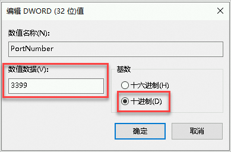

#### Windows 修改 3389 远程端口
1. 按快捷键 Win（Windows 徽标键）+R，启动运行窗口。
2. 输入regedit.exe后按回车键，打开注册表编辑器。
3. 在左侧导航栏，选择HKEY_LOCAL_MACHINE > System > CurrentControlSet > Control > Terminal Server > Wds > rdpwd > Tds > tcp。
4. 右侧列表中找到注册表子项PortNumber并右键单击，选择修改。
5. 在弹出的对话框中，在数值数据的文本框中输入新的远程端口号，在本示例中为3399。在基数区域单击十进制，然后单击确定。

6. 在左侧导航栏，选择HKEY_LOCAL_MACHINE > System > CurrentControlSet > Control > Terminal Server > WinStations > RDP-Tcp。
7. 在右侧列表中找到注册表子项PortNumber并右键单击，选择修改。
8. 在弹出的对话框中，在数值数据的文本框中输入新的远程端口号，在本示例中为3399。在基数区域单击十进制，然后单击确定。

9. 重启机器